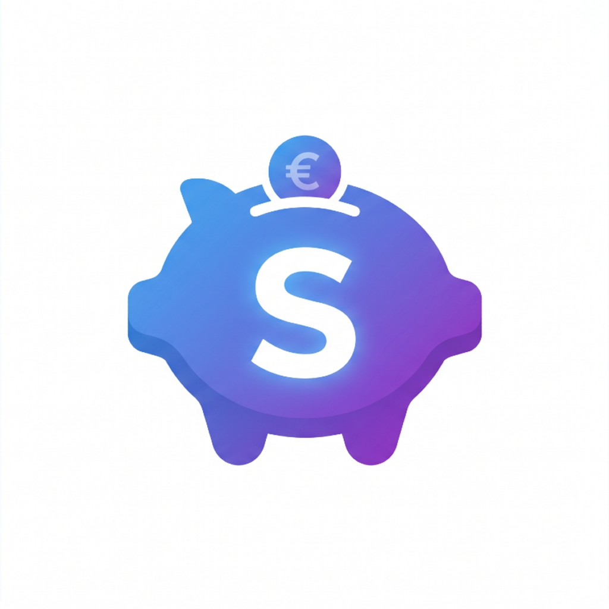
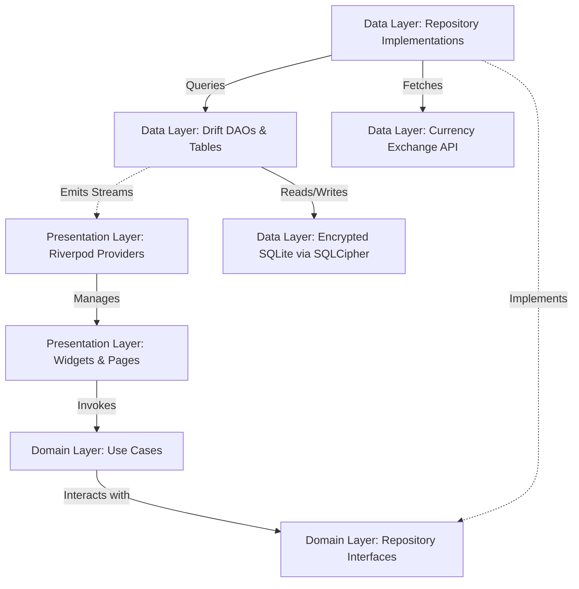

#  Stalvi

[](https://flutter.dev)
[](https://dart.dev)
[](https://sqlite.org)
[](https://www.zetetic.net/sqlcipher/)
[](https://opensource.org/licenses/MIT)

Stalvi is a premium, local-first personal finance control mobile application built with Flutter. It is designed to empower users with full control over their financial data through comprehensive tracking, advanced statistics, and zero-telemetry, offline-first local storage. It features state-of-the-art security, multi-currency support with dynamic conversion, and full localization in English, Spanish, and Catalan.

---

## 📱 Project Overview

Stalvi bridges the gap between premium design aesthetics and absolute privacy. By adopting a **zero-telemetry, offline-first** approach, your sensitive financial information never leaves your device. Database entries are encrypted at rest using SQLCipher, and access keys are generated via cryptographically secure pseudo-random number generators (CSPRNG) stored directly in your device's hardware-backed keystore.

Designed with strict **Clean Architecture** principles, the project ensures isolated testing, maintainable modular layers, and high-performance queries directly at the SQLite level using robust database aggregation.

---

## ✨ Core Features

### 💰 Movement & Transaction Engine
* **Income, Expense, & Transfers:** Record and categorize financial movements.
* **Atomic Transfers:** Dual-movement linked transactions with automatic sync. Restoring or soft-deleting one leg of a transfer automatically mirrors the operation on the other.
* **Category Deletion Safety:** Prompts users to reassign existing transactions when deleting a category in use. Reassignment targets are strictly filtered based on the category type.
* **Historical Exchange Rates:** Saves a currency exchange rate snapshot within each transaction at creation time to preserve historical balance integrity, regardless of future rate fluctuations.
* **Inline Input Validation:** Form inputs perform real-time validations, dynamically resetting and clearing validation errors as values are updated.

### ⏰ Automatic & Recurring Transactions
* **Automated Engine:** Evaluates and automatically generates scheduled transactions based on custom day intervals, weekly, monthly, yearly, or specific days of the month.
* **End-of-Month Clamping:** Implements safe calendar clamping logic (e.g., executing transactions scheduled for the 30th or 31st on February 28th/29th or the last day of short months).
* **Background Tasks & App Startup Fallback:** Operates in the background via `BackgroundSyncService` (driven by `workmanager` using periodic work execution) combined with an asynchronous fallback mechanism at app startup (`main.dart` / Dashboard initialization) to ensure pending automatic transactions are created reliably across platforms.
* **Offline Currency Conversion Fallback:** Provides pre-bundled offline exchange rate fallbacks in the infrastructure layer, ensuring multi-currency conversions and balance summaries function seamlessly even without an active network connection.
* **Strict Opt-In Local Push Notifications:** Dispatches localized push notifications ("Transaction [name] completed successfully" in EN, ES, CA) via `flutter_local_notifications` whenever an automatic transaction is processed. Push notifications default to `false` (OFF) for strict opt-in user consent and privacy compliance. When toggled ON in Profile & Security settings, the app checks native OS permissions (`isPermissionGranted`, `isPermissionPermanentlyDenied`) and prompts for runtime OS permissions or guides the user directly to device system settings (`openAppSettings()`) if permission is permanently denied.
* **Idempotency & UTC+2 Precision:** Employs deterministic UUID v5 URL-based keys to ensure idempotency across multiple runs, strictly validating that only one transaction is generated per execution cycle, calculated precisely using the UTC+2 timezone offset.
* **Soft-Delete Support:** Easily soft-delete recurring templates, moving them to the Recycle Bin and disabling automated generation until restored or permanently purged.

### 📊 Budgets & Savings Goals
* **Budgets:** Set category-specific monthly spending limits mapped to specific accounts, with automatic locks on currency and target amounts post-creation.
* **Savings Goals:** Track financial progress with dedicated targets. Savings goals can be selected directly as destinations in transfers.
* **Read-Only Padlock Indicators:** Visual padlock icons trail strictly read-only/non-editable fields (excluding date fields) on the Budgets and Savings Goals sheets, aligning with the design of the Accounts detail views.
* **Dynamic Recalculations:** Progress bars and spent percentages recalculate in real-time when transactions are added, edited, or deleted.
* **Reactive Notifications:** Receive automatic multi-language push notifications when budget thresholds are exceeded or savings goals are reached.

### 🔍 Concurrent Filters & Analytical Charts
* **Multi-Dimensional Search:** Filter transactions simultaneously by transaction type, category, date range, amount range, tag, and currency using reactive Drift query builders.
* **Real-Time Reactive Statistics:** Period summaries, rolling 30-day analytics, and top-category distribution charts are calculated using real-time Drift reactive streams, updating instantly upon database changes.
* **Visual Analytics:** Premium interactive donut and bar charts with legends, category percentages, color swatches, and tap-interaction tooltips.

### 📥 Compliant Exports & JSON Backups
* **Enhanced CSV/Excel:** Export detailed spreadsheets containing all movement details and historical snapshots.
* **Premium PDF Reports:** Generates clean tabular monthly statements, summary boxes, and category distribution pie charts. Formats transfers as `Source Account -> Destination Account` and embeds custom TTF fonts for perfect multi-currency unicode character rendering.
* **Encrypted JSON Backups:** Export full database backups encrypted with AES-256-CBC using PBKDF2-HMAC-SHA256 key derivation from a user-specified password. Restoring a backup overwrites the active profile username with the one saved in the backup.
* **Native Directory Exports & Directory Prioritization:** File exports adhere to strict public storage priority rules (Android: Priority 1 `/storage/emulated/0/Download`, Priority 2 `/storage/emulated/0/Downloads`, Priority 3 `/storage/emulated/0/Documents`, Priority 4 `/storage/emulated/0/Stalvi`, followed by emergency application documents fallback; iOS: system Downloads and Documents directories). Exports are immediately visible in system file managers and Recents without displaying third-party sharing pop-ups. Files are named based on document type with timestamps: `Stalvi_Backup_`, `Stalvi_Table_`, and `Stalvi_Overview_`. Uses `open_filex` to let users immediately open files after exporting.

### 🛡️ Robust Security Measures
* **Database Encryption:** SQLite database file is encrypted utilizing **SQLCipher (AES-256)**.
* **Hardware-Backed Key Generation:** The cipher key is generated using a secure CSPRNG and stored in the device's hardware-backed secure storage via `flutter_secure_storage` (Android Keystore / iOS Keychain).
* **Secure Authentication:** Protection via a custom 4-to-8 digit PIN and **Biometric Lock** (Face ID / Touch ID) on startup. Includes brute-force lockout protection (lockout cooldown timer persisted in secure storage).
* **Background UI Blurring:** The application window is blurred dynamically using a native app lifecycle wrapper when placed in the background or app switcher to prevent unauthorized visual capture.
* **Discreet Mode:** Toggle button in the app bar instantly masks all financial balances, amounts, and trends across the application under a custom secure obfuscation font.
* **Delete Account (Right to Be Forgotten):** An explicit option in the settings menu drops all database tables, purges all secure storage keychain credentials, and performs a cold application restart to guarantee complete data deletion.

### 🌐 Trilingual Support & Localization
Stalvi is fully localized in three languages, ensuring that all user-facing strings, form validations, error states, and dynamically generated system entities adapt to the active language:
* 🇬🇧 **English**
* 🇪🇸 **Spanish**
* 🏴 **Catalan**

On application launch or language switch, default database entities (such as "My Wallet" / "Mi cartera" / "La meva cartera" and default categories/tags) are dynamically updated in the SQLite tables using stable UUID mapping to prevent duplicates.

---

## 🛠️ Tech Stack & Key Libraries

* **Core SDK:** Flutter (Dart)
* **State Management:** Riverpod (`flutter_riverpod`, `riverpod_generator`)
* **Database / ORM:** Drift (`drift`, `drift_dev`) + `sqlite3`
* **Database Encryption:** SQLCipher (`sqlcipher_flutter_libs`)
* **Security & Storage:** `flutter_secure_storage`, `local_auth`, `encrypt`, `crypto`
* **Charts & Analytics:** `fl_chart`
* **Background Tasks:** `workmanager`
* **Exporting & Utilities:** `pdf`, `file_picker`, `open_filex`, `uuid`, `shared_preferences`, `path_provider`

---

## 📐 Architecture Overview

Stalvi strictly adheres to **Clean Architecture** and a modular layer structure, separating concerns, facilitating automated testing, and isolating components.



### Directory Structure

```
lib/
├── core/               # App-wide configurations, constants, theme, utilities
│   ├── errors/         # Centralized error hierarchy and custom exceptions
│   ├── l10n/           # Localization arb configuration and lookup tools
│   ├── security/       # Hardware keystore integration and encryption keys
│   └── theme/          # Premium custom pastel design tokens
├── data/               # Concrete data sources, SQLite database, mappers, repositories
│   ├── database/       # Drift ORM definition, tables, DAOs, migration scripts
│   ├── mappers/        # Translators between DB entities and domain models
│   ├── network/        # Exchange rate Frankfurter API interface (HTTPS only)
│   └── repositories/   # Implementations of domain repository interfaces
├── domain/             # Business logic layer (independent of frameworks/DBs)
│   ├── entities/       # Pure data structures (Transaction, Budget, Account)
│   ├── repositories/   # Interfaces defining contract requirements
│   └── usecases/       # Atomic business logic modules (AddTransaction, AutoPurge)
└── presentation/       # UI layer (screens, components, and controllers)
    ├── features/       # Screen views organized by functional area (Dashboard, Settings)
    ├── providers/      # Riverpod state management and dependency injection
    └── widgets/        # Reusable custom UI components (ObfuscatedText, EmptyStateWidget)
```

* **Presentation Layer:** Contains UI widgets and Riverpod state management providers. It responds to changes in the database and updates the UI asynchronously.
* **Domain Layer:** Contains core enterprise business rules, pure entities, use cases, and repository contracts. It contains no reference to external libraries, databases, or frameworks.
* **Data Layer:** Handles data retrieval, caching, serialization, encryption, and storage, implementing the repository interfaces defined in the Domain layer.

---

## 🚀 Getting Started & Installation

### Prerequisites
* [Flutter SDK](https://docs.flutter.dev/get-started/install) (version `>=3.2.0 <4.0.0`)
* Android Studio / SDK (for Android builds)
* Xcode (for iOS builds, macOS required)
* CocoaPods (for iOS dependency resolution)

### Configuration

1. **Clone the repository:**
   ```bash
   git clone https://github.com/CarlesPV/Konta.git stalvi
   cd stalvi
   ```

2. **Get dependencies:**
   ```bash
   flutter pub get
   ```

3. **Generate Code (Drift/Riverpod):**
   Stalvi uses `build_runner` to generate code for the Drift database and Riverpod providers. Run the following command before compiling:
   ```bash
   flutter pub run build_runner build --delete-conflicting-outputs
   ```
   *(Alternatively, use `flutter pub run build_runner watch` during development to regenerate files on changes).*

4. **Run the Application:**
   * Run the app in development mode:
     ```bash
     flutter run
     ```
   * Or run using the helper script:
     ```bash
     ./run_Stalvi.sh
     ```

### Testing
To run the automated test suite (including unit, widget, and architecture tests):
```bash
flutter test
```
Or execute the automated test shell script:
```bash
./generate_tests.sh
```
To run static analysis check for lints and formatting:
```bash
flutter analyze
```
